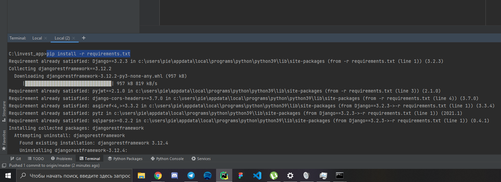
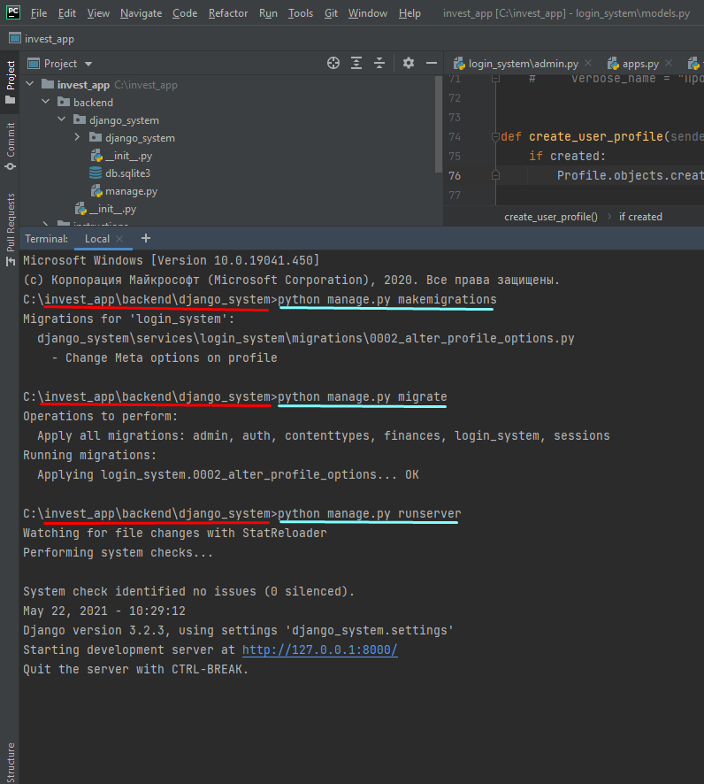
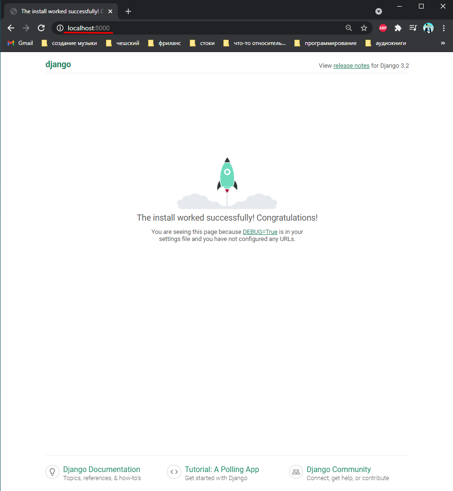

<h1>How to start project:</h1>

Firs of all, check installed git,Python and pip. 
After, you can use command in terminal:

<code>git clone https://github.com/mrpie228/invest_app</code>

OR

Then you need to input: 
<code>pip install -r requirements.txt</code> 

After go to "..\invest_app\backend\django_system" and input this: 

<code>python manage.py makemigrations</code> 
<code>python manage.py migrate</code> 
<code>python manage.py runserver</code> 

<h2>congratulations!</h2>
