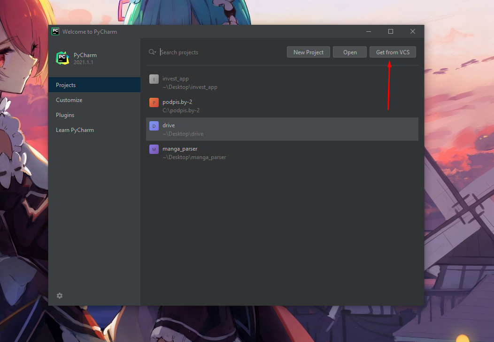
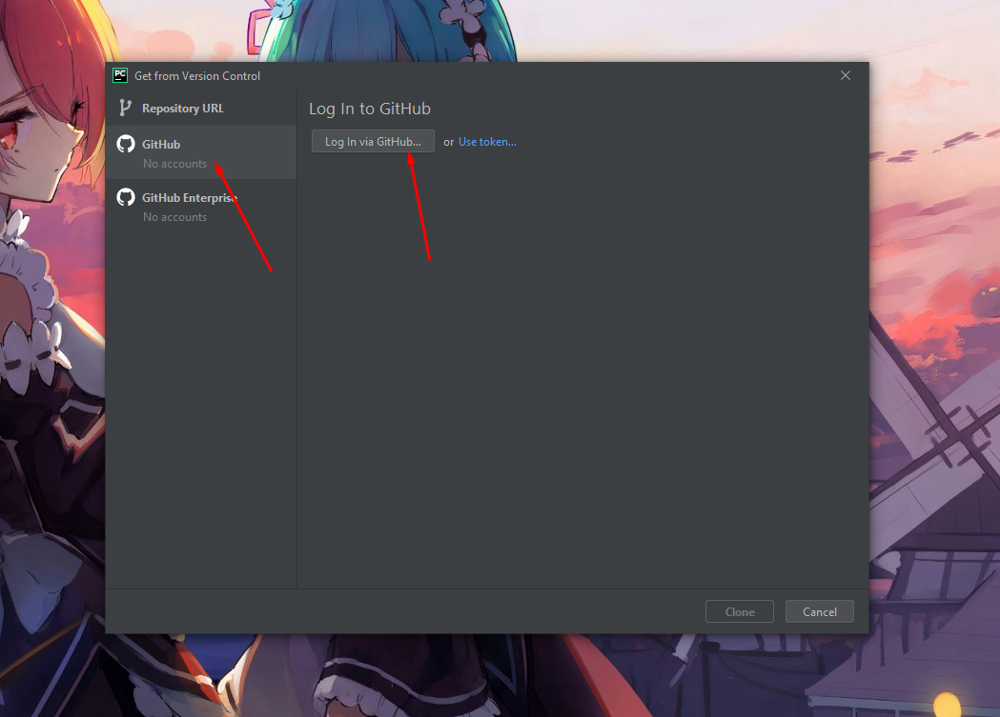
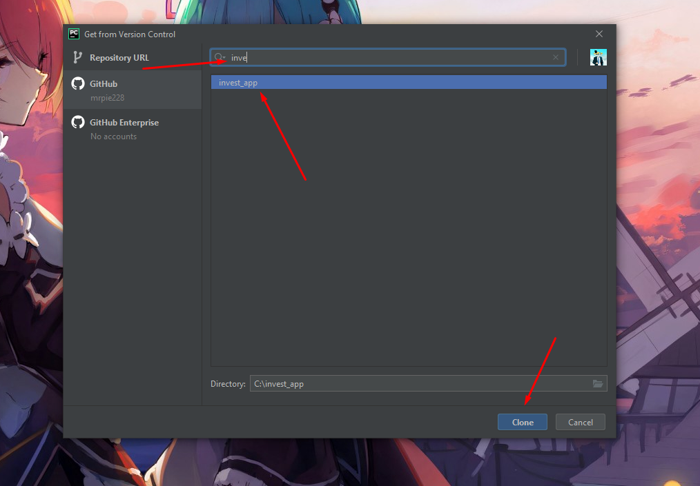
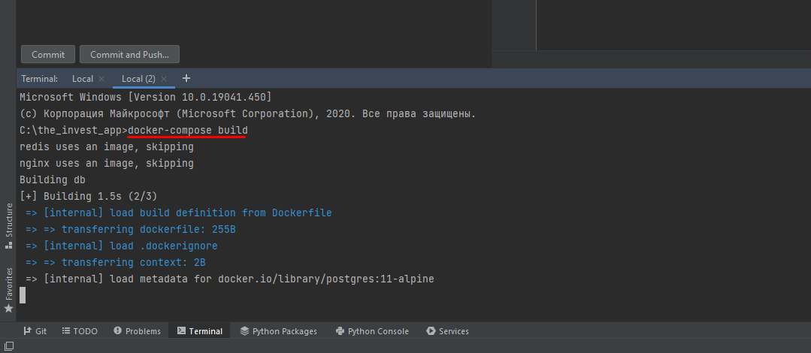
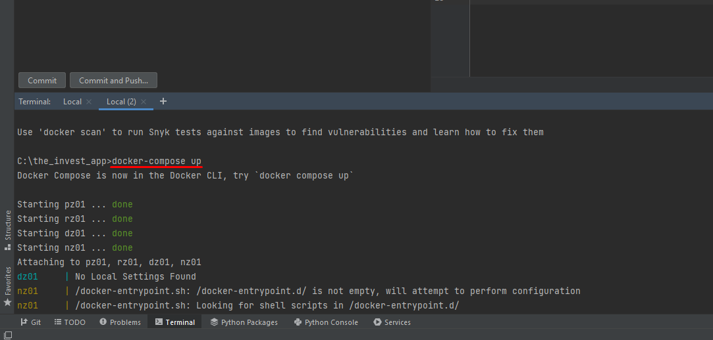

<h1>How to start project:</h1>

Firs of all, check installed Docker 
After, you can use command in terminal:

<code>git clone https://github.com/mrpie228/invest_app</code>

OR

Then you need to input: 
<code>docker-compose build</code> 

<code>docker-compose up</code> 

<h2>congratulations!</h2>
